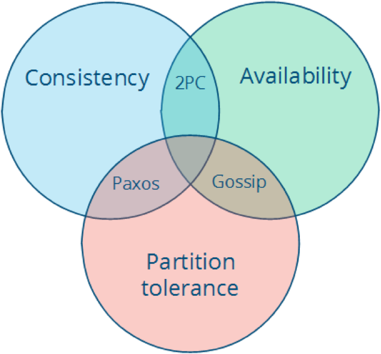
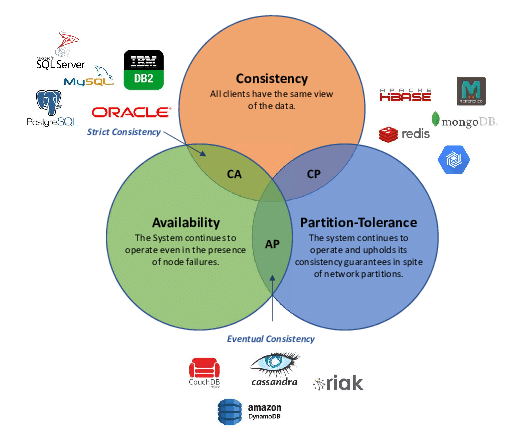
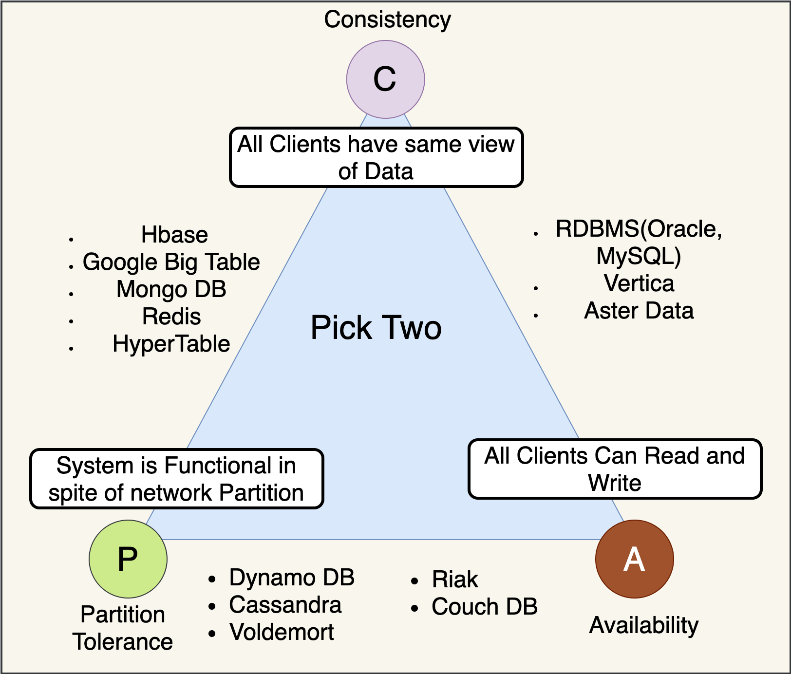
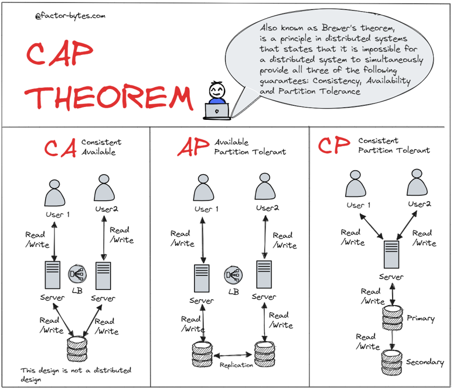
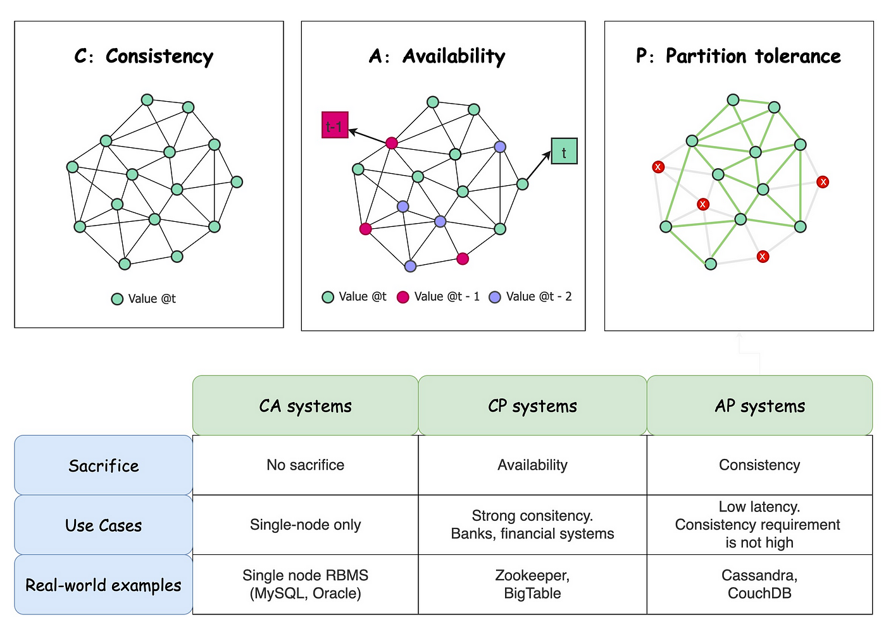
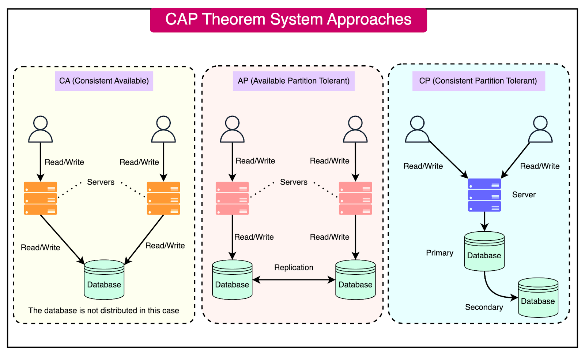
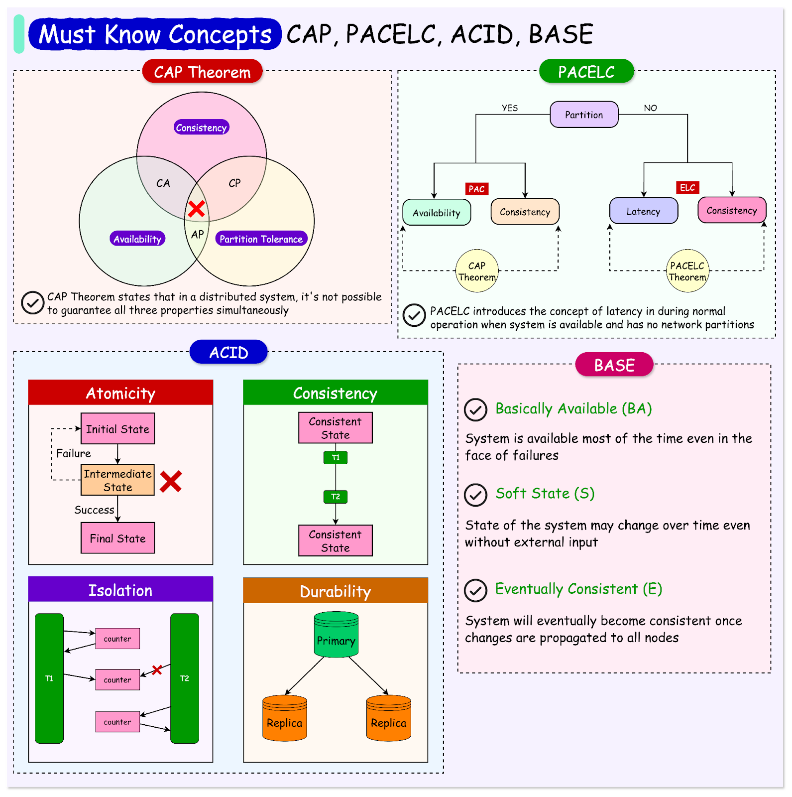

[#cap-theorem]
= CAP 理论

TIP: 图片可以再丰富一下，把各种协议的代表产品写出来。例如像下图：

== 参考资料

. https://factor-bytes.com/2023/07/22/understanding-cap-theorem-balancing-consistency-availability-and-partition-tolerance-in-distributed-systems/[Understanding CAP Theorem: Balancing Consistency, Availability, and Partition Tolerance in Distributed Systems – FactorBytes^]
. https://blog.det.life/understanding-the-cap-theorem-implications-for-distributed-databases-675f5a8aaf82[Understanding the CAP Theorem: Implications for Distributed Databases | by Anto Semeraro | Data Engineer Things^]
. https://blog.bytebytego.com/p/cap-pacelc-acid-base-essential-concepts[CAP, PACELC, ACID, BASE - Essential Concepts for an Architect’s Toolkit^]
. https://www.scylladb.com/glossary/pacelc-theorem/[What is the PACELC Theorem? Definition & FAQs | ScyllaDB^]
