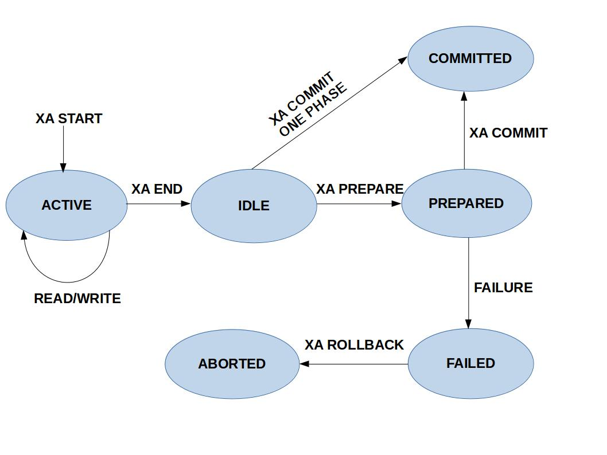

[#xa-mysql]
= MySQL 原生 XA 支持

// 先使用 SQL 模拟一遍，然后使用 Java 代码模拟一遍。

[{sql_src_attr}]
----
XA {START|BEGIN} xid [JOIN|RESUME]

XA END xid [SUSPEND [FOR MIGRATE]]

XA PREPARE xid

XA COMMIT xid [ONE PHASE]

XA ROLLBACK xid

XA RECOVER [CONVERT XID]
----

image::assets/images/2pc-success.png[{image_attr}]

== 参考资料

. https://dev.mysql.com/blog-archive/improvements-to-xa-support-in-mysql-5-7/[MySQL :: Improvements to XA Support in MySQL 5.7^] -- 很重要的一个文档！
. https://dev.mysql.com/doc/refman/8.4/en/xa.html[MySQL :: MySQL 8.4 Reference Manual :: 15.3.8 XA Transactions^]
. https://dev.mysql.com/worklog/task/?id=6860[MySQL :: WL#6860: Binlogging XA-prepared transaction^] -- 貌似 XA 的设计文档
. https://zhuanlan.zhihu.com/p/372300181[无处不在的 MySQL XA 事务 - 知乎^]
. https://cloud.tencent.com/developer/article/2194079[MySQL 中基于 XA 实现的分布式事务-腾讯云开发者社区-腾讯云^]
. https://en.wikipedia.org/wiki/Two-phase_commit_protocol[Two-phase commit protocol - Wikipedia^]
. https://dev.mysql.com/doc/refman/8.4/en/xa-statements.html[MySQL 8.4 Reference Manual :: 15.3.8.1 XA Transaction SQL Statements^]
. https://dev.mysql.com/doc/refman/8.4/en/xa-states.html[MySQL 8.4 Reference Manual :: 15.3.8.2 XA Transaction States^]
