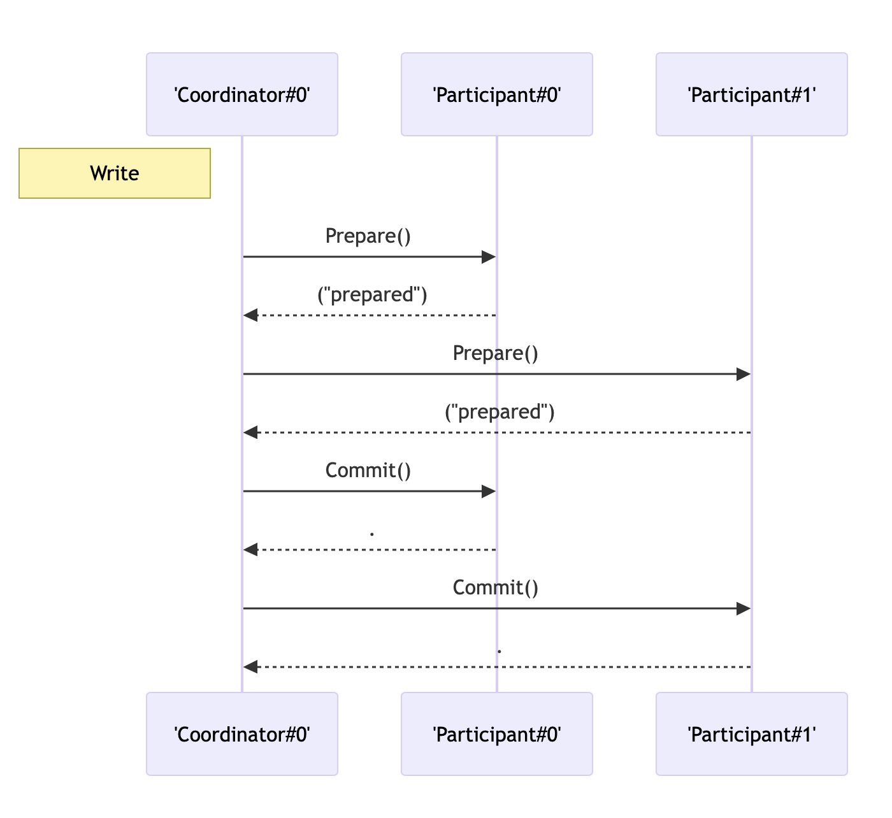

[#xa-mysql]
= MySQL 原生 XA 支持

image::assets/images/xa-mysql-diag.jpg[{image_attr}]

根据 https://dev.mysql.com/doc/refman/8.4/en/xa-states.html[MySQL 文档^] 所述，MySQL 的状态变化流程如下：

. 执行 `XA START`，进入到 `ACTIVE` 状态；
. 在 `ACTIVE` 状态，就可以执行常规的增删改查 SQL 语句来对操作数据；
. 执行 `XA END`，进入到 `IDLE` 状态。在这个状态不能执行操作数据的 SQL 语句了。接下来有两种情况：
.. 执行 `XA COMMIT xid ONE PHASE` 直接进去 `COMMITTED` 终态，事务结束。这种情况，只在当只有一个参与者时才可能发生。
.. 执行 `XA PREPARE`，进入到 `PREPARED` 状态。这里也只有两种状态：
... 执行 `XA COMMIT` 直接进去 `COMMITTED` 终态，事务结束。
... 执行 `XA COMMIT` 失败或者发生错误，进入 `FAILED`。
... 最后，通过执行 `XA ROLLBACK` 中断事务的执行，进入到 `ABORTED` 终态。

// 先使用 SQL 模拟一遍，然后使用 Java 代码模拟一遍。

[{sql_src_attr}]
----
XA {START|BEGIN} xid [JOIN|RESUME]

XA END xid [SUSPEND [FOR MIGRATE]]

XA PREPARE xid

XA COMMIT xid [ONE PHASE]

XA ROLLBACK xid

XA RECOVER [CONVERT XID]
----

根据上述状态图，结合应用程序，整体执行流程如下：

image::assets/images/xa-process.jpg[{image_attr}]

TIP: D瓜哥私以为，这是我见过最符合实际代码流程的图片。

来查看一下 MySQL 对 XA 的支持情况：

[{sql_src_attr}]
----
mysql> select version();
+-----------+
| version() |
+-----------+
| 8.4.5     |
+-----------+
1 row in set (0.00 sec)

mysql> show engines;
+--------------------+---------+----------------------------------------------------------------+--------------+------+------------+
| Engine             | Support | Comment                                                        | Transactions | XA   | Savepoints |
+--------------------+---------+----------------------------------------------------------------+--------------+------+------------+
| ndbcluster         | NO      | Clustered, fault-tolerant tables                               | NULL         | NULL | NULL       |
| MEMORY             | YES     | Hash based, stored in memory, useful for temporary tables      | NO           | NO   | NO         |
| InnoDB             | DEFAULT | Supports transactions, row-level locking, and foreign keys     | YES          | YES  | YES        |
| PERFORMANCE_SCHEMA | YES     | Performance Schema                                             | NO           | NO   | NO         |
| MyISAM             | YES     | MyISAM storage engine                                          | NO           | NO   | NO         |
| FEDERATED          | NO      | Federated MySQL storage engine                                 | NULL         | NULL | NULL       |
| ndbinfo            | NO      | MySQL Cluster system information storage engine                | NULL         | NULL | NULL       |
| MRG_MYISAM         | YES     | Collection of identical MyISAM tables                          | NO           | NO   | NO         |
| BLACKHOLE          | YES     | /dev/null storage engine (anything you write to it disappears) | NO           | NO   | NO         |
| CSV                | YES     | CSV storage engine                                             | NO           | NO   | NO         |
| ARCHIVE            | YES     | Archive storage engine                                         | NO           | NO   | NO         |
+--------------------+---------+----------------------------------------------------------------+--------------+------+------------+
11 rows in set (0.00 sec)
----

在图示的 MySQL 版本中，只有 InnoDB 支持事务，也只有 InnoDB 支持 XA 协议。

因为 XA 事务是基于两阶段提交协议的，所以需要有一个事务协调者（Transaction Manager）来保证所有的事务参与者都完成了准备工作(第一阶段)。如果事务协调者（Transaction Manager）收到所有参与者都准备好的消息，就会通知所有的事务都可以提交了（第二阶段）。在DTP模型中，MySQL 属于资源管理器(Resource Manager)。MySQL 对 XA 分布式事务的支持，一般指的是单台 MySQL 实例如何执行自己的事务分支。

== 参考资料

. https://dev.mysql.com/blog-archive/improvements-to-xa-support-in-mysql-5-7/[MySQL :: Improvements to XA Support in MySQL 5.7^] -- 很重要的一个文档！
. https://dev.mysql.com/doc/refman/8.4/en/xa.html[MySQL :: MySQL 8.4 Reference Manual :: 15.3.8 XA Transactions^]
. https://dev.mysql.com/worklog/task/?id=6860[MySQL :: WL#6860: Binlogging XA-prepared transaction^] -- 貌似 XA 的设计文档
. https://zhuanlan.zhihu.com/p/372300181[无处不在的 MySQL XA 事务 - 知乎^]
. https://cloud.tencent.com/developer/article/2194079[MySQL 中基于 XA 实现的分布式事务-腾讯云开发者社区-腾讯云^]
. https://en.wikipedia.org/wiki/Two-phase_commit_protocol[Two-phase commit protocol - Wikipedia^]
. https://dev.mysql.com/doc/refman/8.4/en/xa-statements.html[MySQL 8.4 Reference Manual :: 15.3.8.1 XA Transaction SQL Statements^]
. https://dev.mysql.com/doc/refman/8.4/en/xa-states.html[MySQL 8.4 Reference Manual :: 15.3.8.2 XA Transaction States^]
. https://github.com/asdbex1078/MySQL/blob/master/mysql-storage-engines/innodb/1.6.8.0.InnoDB%E4%BA%8B%E5%8A%A1%E2%80%94%E2%80%94%E5%88%86%E5%B8%83%E5%BC%8F%E4%BA%8B%E5%8A%A1%E4%B9%8BXA.md[MySQL/mysql-storage-engines/innodb/1.6.8.0.InnoDB事务——分布式事务之XA.md at master · asdbex1078/MySQL^]
